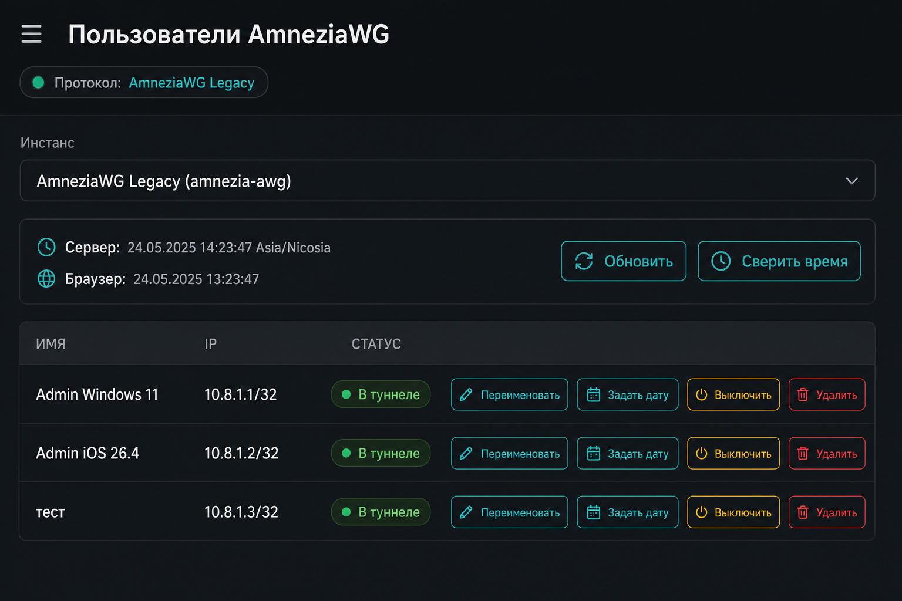
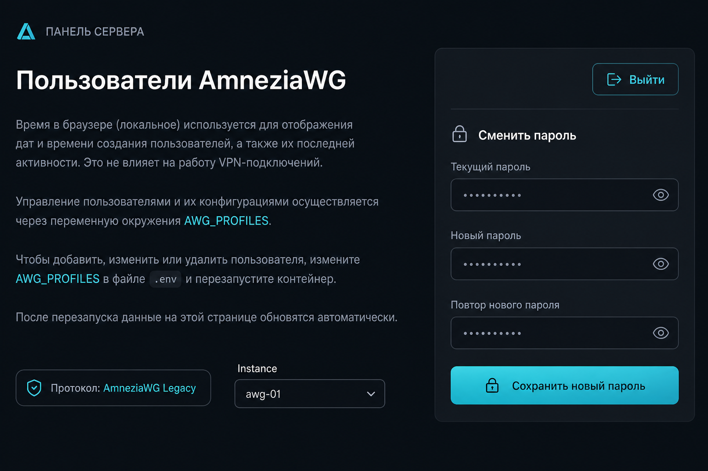

# Amnezia Admin WebUI

Веб-панель на вашем VPS для управления клиентами **AmneziaWG**: вкл/выкл, удаление, переименование, дата отключения; при нескольких контейнерах — переключатель **«Инстанс»** (`AWG_PROFILES`); **экспорт .conf** при наличии `last_config`; **новый клиент под каскад** (свой Endpoint и ключи на сервере). **Cloudflare WARP** — *необязательное* дополнение: часть клиентов может выходить в интернет через интерфейс `warp` внутри контейнера AWG (ставится отдельно скриптом на хосте). Работает через Docker и `docker exec` в контейнер **Amnezia** (по умолчанию `amnezia-awg2`).

Справочник по интерфейсу, типичным сбоям и HTTP API: **[docs/panel-guide.md](docs/panel-guide.md)**.

**Безопасность:** контейнер с монтированием `docker.sock` эквивалентен root на хосте — используйте сложный пароль и по возможности ограничьте доступ по IP или TLS.

## Что открывается по какому порту

| Адрес | Назначение |
|-------|------------|
| **`http://IP:HOST_PORT`** (по умолчанию **`:8080`**) | **Админ-панель:** клиенты AmneziaWG, опциональный блок **Cloudflare WARP**, каскад, экспорт `.conf`, смена пароля. Внизу страницы — футер со ссылками автора (GitHub, донат, Telegram и т.д.). |
| **`http://IP:LANDING_PORT`** (по умолчанию **`:80`**) | **Публичная страница** для приглашённых: инструкция, кнопка перехода в админку (`landing/admin-port.js` подставляет тот же `HOST_PORT`). Текст «проблемы — администратору сервера» и дисклеймер. **Без** блока доната и личных ссылок автора — они только в админке. |

Если порт **80** занят другим сервисом, задайте **`LANDING_PORT`** (например `8081`) или **`SKIP_LANDING=1`**. На работу панели по **`HOST_PORT`** это не влияет.

## Скриншоты

<p align="center">

<br/><br/>

</p>

Файлы: `docs/screenshots/panel-users-table.png`, `docs/screenshots/panel-overview-password.png` — при желании замените их своими скриншотами с теми же именами.

---

## Установка одной командой

На сервере под **root** (или через `sudo`), когда репозиторий уже опубликован на GitHub:

```bash
curl -fsSL https://raw.githubusercontent.com/andrey271192/Amnezia_web/main/scripts/install.sh | sudo bash
```

### Переменные окружения и `sudo`

Частая ошибка: задали **`AWG_PROFILES`**, **`ADMIN_PASSWORD`** или другую переменную из таблицы «в одной строке» перед `curl`, а затем выполнили **`curl … | sudo bash`**. По умолчанию **`sudo` не передаёт** это окружение в `bash`, который читает установочный скрипт с stdin: установщик **не увидит** переменные, переключатель **«Инстанс»** не появится.

**Надёжные варианты:**

1. **`sudo -E bash`** вместо `sudo bash` (для большинства VPS достаточно):

```bash
AWG_PROFILES='[{"id":"awg",…}]' curl -fsSL https://raw.githubusercontent.com/andrey271192/Amnezia_web/main/scripts/install.sh | sudo -E bash
```

2. **Файл на VPS** (способ без `-E`): записать JSON **одной строкой** в **`/root/amnezia-admin.awg-profiles.json`** (например `umask 077; printf '%s\n' '[{"id":"awg",…}]' > /root/amnezia-admin.awg-profiles.json`), затем обычный **`curl … | sudo bash`** — установщик подставит профили из файла (см. абзац про снимок ниже таблицы).

3. Установка под **`root`** без `sudo`: **`curl … | bash`** — переменные текущей оболочки доходят до скрипта.

**Не используйте** конструкции вроде **`curl … | bash -c "sudo -E bash"`**: stdin установочного скрипта должен попасть **напрямую** в тот `bash`, который его выполняет.

**Безопасность:** не публикуйте пароли от VPS, ключи и дампы `clientsTable` в Issues, чатах и скриншотах — это полный компромисс сервера.


Другой репозиторий или ветка:

```bash
GITHUB_REPO=ваш/форк BRANCH=main curl -fsSL https://raw.githubusercontent.com/ваш/форк/main/scripts/install.sh | sudo bash
```

Уже скачали проект вручную в `/opt/amnezia-admin`:

```bash
cd /opt/amnezia-admin && chmod +x scripts/install.sh && sudo SKIP_DOWNLOAD=1 bash scripts/install.sh
```

Переменные установки (необязательно):

| Переменная | По умолчанию | Назначение |
|------------|--------------|------------|
| `GITHUB_REPO` | `andrey271192/Amnezia_web` | Откуда качать архив |
| `BRANCH` | `main` | Ветка |
| `INSTALL_DIR` | `/opt/amnezia-admin` | Куда распаковать исходники |
| `DATA_DIR` | `/opt/amnezia-admin-data` | Том с `password.hash` и сессией |
| `HOST_PORT` | `8080` | Порт HTTP панели на хосте |
| `AWG_CONTAINER` | `amnezia-awg2` | Имя контейнера Amnezia WG |
| `AWG_PROFILES` | _(нет)_ | JSON-массив профилей: несколько контейнеров/путей (см. ниже). Если задан — переключатель «Инстанс» в вебе. При однострочной установке с переменной в окружении нужен **`sudo -E bash`** или файл **`/root/amnezia-admin.awg-profiles.json`** — см. раздел **«Переменные окружения и sudo»** выше. В каждом объекте можно задать `warpDir`, `warpConf`, `warpClientsList`, `startScript` — см. раздел **Cloudflare WARP** |
| `WARP_DIR` | `/opt/warp` | В контейнере AWG: каталог для `warp.conf` и `clients.list` |
| `WARP_CONF_PATH` | `{WARP_DIR}/warp.conf` | Нестандартный путь к конфигу WARP |
| `WARP_CLIENTS_LIST` | `{WARP_DIR}/clients.list` | Список строк `10.8.x.x/32` — кому маршрутизировать трафик через интерфейс `warp` |
| `AMNEZIA_START_SCRIPT` | `/opt/amnezia/start.sh` | Куда встраивается блок автоподъёма WARP после перезапуска (маркеры совместимы с прежним `warp-manager`) |
| `WARP_SSH_INSTALL_DIR` | `/opt/amnezia-admin` | Каталог на **хосте VPS**, откуда по SSH выполняется `scripts/warp-amnezia.sh` при установке/удалении WARP из панели (`POST /api/warp/host-setup`) |
| `SCHEDULE_DISCONNECT_MS` | `60000` | Как часто планировщик проверяет отложенное отключение из туннеля (мс) |
| `TZ` | _(часто UTC в Docker)_ | Пояс строки «Сервер» в панели (IANA, например `Europe/Berlin`). Без `TZ` берётся из образа (часто UTC) — тогда от браузера будет видна разница часов |
| `TIME_SYNC_SSH_HOST` | `172.17.0.1` | Хост для SSH root при синхронизации времени из панели (часто шлюз Docker к хосту) |
| `TIME_SYNC_DISABLED` | `0` | `1` — скрыть/отключить синхронизацию времени по SSH |
| `CLIENT_CONFIG_ENDPOINT` | _(нет)_ | Публичный IP или DNS VPS для строки `Endpoint` при сборке `.conf` из `last_config`, если нет `hostName` в JSON и заходите в панель не по IP |
| `CLIENT_EXPORT_DNS1` | `8.8.8.8` | DNS в экспортируемом клиентском конфиге |
| `CLIENT_EXPORT_DNS2` | `8.8.4.4` | Второй DNS в экспортируемом конфиге |
| `EXPORT_CONFIG_SECRET` | _(нет)_ | Секрет для прямой ссылки без входа в панель: `GET /api/clients/export-config?token=СЕКРЕТ&clientId=…&profileId=…` (при нескольких инстансах `profileId` обязателен). Не светите URL посторонним |
| `ADMIN_PASSWORD` | _(генерируется)_ | Первый пароль вместо файла |
| `SKIP_DOWNLOAD` | `0` | `1` — не качать GitHub, собрать из `INSTALL_DIR` |
| `ALLOW_DEFAULT_PASSWORD` | `0` | `1` — см. раздел «Пароль» ниже |
| `SKIP_LANDING` | `0` | `1` — не поднимать nginx-лендинг на `LANDING_PORT` |
| `LANDING_PORT` | `80` | Порт nginx-лендинга (если `80` занят — например `8081`) |
| `LANDING_CONTAINER` | `amnezia-web-landing` | Имя контейнера лендинга |
| `NO_CACHE` | `0` | `1` — `docker build --no-cache` при проблемах с обновлением образа |
| `UI_HIDE_SECTIONS` | _(нет)_ | Список через запятую: **`users`**, **`warp`**, **`cascade`** — скрыть блоки в веб-панели (см. ниже). При обновлении через `install.sh` значение подтягивается из старого контейнера, если не задано заново |
| `UI_HIDE_USERS` | `0` | `1` или `true` — эквивалент `users` в `UI_HIDE_SECTIONS` |
| `UI_HIDE_WARP` | `0` | `1` — эквивалент `warp` (также блокируются `POST /api/warp/*`) |
| `UI_HIDE_CASCADE` | `0` | `1` — эквивалент `cascade` (блокируется `POST /api/clients/create-cascade`) |

Переменная **`AWG_PROFILES`** при установке автоматически сохраняется в **`/root/amnezia-admin.awg-profiles.json`** на VPS; при следующем запуске `install.sh` без `AWG_PROFILES` значение подставляется из этого файла или из **старого контейнера** `amnezia-admin` перед его удалением — так переключатель «Инстанс» не пропадает после обновления панели.

#### Несколько инстансов (AmneziaWG + Legacy и т.д.)

Пути и имена контейнеров на сервере могут отличаться — проверьте внутри контейнера (`docker exec … ls /opt/amnezia`). Установщик сохраняет JSON в **`/root/amnezia-admin.awg-profiles.json`** и при следующем запуске подставляет его, если вы не передали `AWG_PROFILES`.

**Пример 1** — классическая схема: новый AWG в `amnezia-awg2`, Legacy в отдельном контейнере с каталогом `wireguard`:

```bash
AWG_PROFILES='[{"id":"awg","label":"AmneziaWG","container":"amnezia-awg2","confPath":"/opt/amnezia/awg/awg0.conf","clientsPath":"/opt/amnezia/awg/clientsTable","iface":"awg0","wgBinary":"awg","pskPath":"/opt/amnezia/awg/wireguard_psk.key"},{"id":"legacy","label":"AmneziaWG Legacy","container":"amnezia-wg0","confPath":"/opt/amnezia/wireguard/wg0.conf","clientsPath":"/opt/amnezia/wireguard/clientsTable","iface":"wg0","wgBinary":"wg","pskPath":"/opt/amnezia/wireguard/wireguard_psk.key"}]' \
curl -fsSL https://raw.githubusercontent.com/andrey271192/Amnezia_web/main/scripts/install.sh | sudo -E bash
```

**Пример 2** — оба конфигурационных набора внутри контейнера **`amnezia-awg`** (файл `wg0.conf` рядом с `awg0.conf` в `/opt/amnezia/awg/`), второй контейнер **`amnezia-awg2`**:

```bash
AWG_PROFILES='[{"id":"awg","label":"AmneziaWG","container":"amnezia-awg2","confPath":"/opt/amnezia/awg/awg0.conf","clientsPath":"/opt/amnezia/awg/clientsTable","iface":"awg0","wgBinary":"awg","pskPath":"/opt/amnezia/awg/wireguard_psk.key"},{"id":"legacy","label":"AmneziaWG Legacy","container":"amnezia-awg","confPath":"/opt/amnezia/awg/wg0.conf","clientsPath":"/opt/amnezia/awg/clientsTable","iface":"wg0","wgBinary":"wg","pskPath":"/opt/amnezia/awg/wireguard_psk.key"}]' \
curl -fsSL https://raw.githubusercontent.com/andrey271192/Amnezia_web/main/scripts/install.sh | sudo -E bash
```

Для **Legacy** часто используется обычный `wg`, для новой AmneziaWG — **`awg`**; поле **`pskPath`** желательно указывать явно, если путь к `wireguard_psk.key` нестандартный.

Если в вебе пропал список **«Инстанс»**, смотрите раздел «Если пропал список Инстанс» в **[docs/panel-guide.md](docs/panel-guide.md)**.

Если на хосте уже запущено **несколько** контейнеров с именами вида **`amnezia-awg*`**, а в панели по-прежнему один инстанс — задайте **`AWG_PROFILES`** (или файл **`/root/amnezia-admin.awg-profiles.json`**) и перезапустите установщик; при запуске **`install.sh`** без профилей в этом случае выводится предупреждение в консоль.

### Cloudflare WARP (необязательно)

**Устанавливать не обязательно.** Панель и обычный AmneziaWG работают без WARP. Статус **«Не установлен»** значит: в контейнере AWG ещё **нет** `warp.conf` (скрипт на VPS не запускали) — это не ошибка.

Раздел **Cloudflare WARP** в веб-интерфейсе нужен только если вы хотите, чтобы **выбранные** клиенты (с IPv4 `10.8.x.x/32` в AllowedIPs) выходили в интернет через туннель Cloudflare внутри контейнера AWG.

- **Не нужен WARP** — ничего на хосте не запускайте. В панели будет статус **«Не установлен»** — это нормально, блок можно не трогать.
- **Нужен WARP** — в панели кнопка **«Установить WARP на VPS»** (пароль root по SSH, как у синхронизации времени хоста; нужны `sshpass` в образе панели и не отключённый `TIME_SYNC_DISABLED`) **или** один раз на хосте VPS (root), из каталога репозитория (часто `/opt/amnezia-admin`):

```bash
cd /opt/amnezia-admin
chmod +x scripts/warp-amnezia.sh
# при необходимости: AWG_CONTAINER=имя_контейнера
./scripts/warp-amnezia.sh install
```

Скрипт регистрирует туннель через [wgcf](https://github.com/ViRb3/wgcf), создаёт `warp.conf` в контейнере (`/opt/warp` по умолчанию). Дальше в панели отмечаете клиентов и жмёте **«Применить маршрутизацию»** (контейнер AWG перезапустится).

#### Бесплатный WARP и платные продукты Cloudflare

**wgcf** использует тот же по сути **бесплатный** потребительский туннель WARP, что и мобильное приложение Cloudflare WARP. Отдельные **платные** корпоративные сервисы Cloudflare (Zero Trust / Teams и т.п.) — другая модель: политики, доступ и способ выдачи конфигурации. **Подключить «платный тариф» этой панели одной кнопкой нельзя** — нужен WireGuard-совместимый профиль от вашего договора с Cloudflare и ручная подстановка (замена `warp.conf` и маршрутов), это не входит в автоматический установщик.

Подкоманды: `install`, `start`, `stop`, `status`, `rekey`, **`uninstall`**. Учёт wgcf на хосте: `/root/wgcf-account.toml` (и бинарник `/root/wgcf`, если скачан).

**Полностью убрать WARP** — кнопка **«Удалить WARP с VPS»** в веб-панели (SSH с паролем root, как при установке) **или** на хосте вручную (интерфейс `warp`, правила маршрутизации/NAT, блок `# --- WARP-MANAGER ---` в `start.sh`, `warp.conf` и список клиентов в каталоге WARP в контейнере; затем перезапуск контейнера AWG):

```bash
cd /opt/amnezia-admin
./scripts/warp-amnezia.sh uninstall
# нестандартный путь к start.sh в контейнере: AMNEZIA_START_SCRIPT=/путь ./scripts/warp-amnezia.sh uninstall
```

Файлы **wgcf** на хосте (`/root/wgcf-account.toml`, `/root/wgcf-profile.conf`, бинарник `wgcf`) скрипт **не** удаляет — при желании удалите вручную.

Маркеры в `start.sh` (`# --- WARP-MANAGER BEGIN ---`) совместимы с прежним `warp-manager`, если вы уже использовали его.

Необязательно задавать в контейнере **amnezia-admin** переменные `WARP_DIR`, `WARP_CONF_PATH`, `WARP_CLIENTS_LIST`, `AMNEZIA_START_SCRIPT` через установщик — см. таблицу выше.

### Скрытие разделов в панели (`UI_HIDE_*`)

Чтобы упростить интерфейс, можно **не показывать** отдельные блоки:

| Токен в `UI_HIDE_SECTIONS` | Что скрывается |
|---------------------------|----------------|
| `users` | Секция **«Пользователи»** (таблица) и отладочный вывод **awg show**. Запрос **`GET /api/clients`** по-прежнему нужен странице — API для вкл/выкл peer и экспорта **не отключается**, скрыта только таблица. |
| `warp` | Блок **Cloudflare WARP**; запросы **`POST /api/warp/*`** отвечают **403**. |
| `cascade` | Блок **«Новый клиент под каскад»**; **`POST /api/clients/create-cascade`** отвечает **403**. |

Пример установки / обновления с частично пустой панелью:

```bash
UI_HIDE_SECTIONS=warp,cascade curl -fsSL https://raw.githubusercontent.com/andrey271192/Amnezia_web/main/scripts/install.sh | sudo -E bash
```

Отдельные флаги **`UI_HIDE_USERS`**, **`UI_HIDE_WARP`**, **`UI_HIDE_CASCADE`** (`1` или `true`) дублируют соответствующий токен.

Итоговые URL после установки совпадают с таблицей **«Что открывается по какому порту»** в начале этого файла; установщик записывает выбранный `HOST_PORT` в **`landing/admin-port.js`**, чтобы кнопка на лендинге вела на нужную админку.

### Каскад (свой Endpoint для клиента)

В панели блок **«Новый клиент под каскад»**: задаёте IP/DNS и при необходимости порт — сервер **генерирует ключи**, добавляет peer в текущий инстанс AmneziaWG и отдаёт `.conf`, где **Endpoint** указывает на ваш промежуточный узел. На этом узле нужен **проброс UDP** на VPS (тот же порт, что слушает WG на сервере, либо свой порт из формы).

### Экспорт конфигурации клиента (.conf)

Если в записи клиента на сервере есть **`userData.last_config`** (JSON из приложения Amnezia с полем **`config`** — готовый текст — или с **`client_priv_key`** и ключами сервера), в таблице появятся **«Скачать .conf»**, **«Прямая ссылка»** и **«Копировать URL»**. Прямая ссылка имеет вид  
`/api/clients/export-config?clientId=…&profileId=…` — последний параметр нужен только при нескольких инстансах (`AWG_PROFILES`). Работает в браузере, где вы уже вошли в панель (cookie-сессия).

Чтобы скачивать **без входа в панель**, задайте **`EXPORT_CONFIG_SECRET`** при установке и открывайте  
`/api/clients/export-config?token=ВАШ_СЕКРЕТ&clientId=…` — при **нескольких** профилях добавьте **`&profileId=…`**. Не пересылайте такую ссылку третьим лицам.

Если на VPS только «голый» `clientsTable` без `last_config`, готового экспорта по старым строкам не будет — используйте блок **«Новый клиент под каскад»** или приложение Amnezia на устройстве.

Для корректного **`Endpoint`** задайте **`CLIENT_CONFIG_ENDPOINT`** при установке (публичный IP или домен VPS), либо убедитесь, что в `last_config` указан **`hostName`**, либо открывайте панель по тому же хосту, который клиенты должны использовать для подключения (не `localhost`).

Имя скачиваемого файла в заголовке **`Content-Disposition`** составляется только из **ASCII** (латиница, цифры, `.`, `_`, `-`). Если имя клиента в приложении на кириллице или с другими символами, в имени файла используется безопасный фрагмент (например префикс `clientId`), чтобы ответ не падал с ошибкой заголовка в Node.js.

### Обновление до новой версии

Коммиты на GitHub **сами не попадают** в уже запущенный контейнер: нужно заново **скачать код и пересобрать образ** (`amnezia-admin` и, если не отключали лендинг, **`amnezia-web-landing`**).

Проще всего — та же команда, что при установке (данные в `DATA_DIR`, пароль и `AWG_PROFILES` сохранятся — профили подтягиваются из файла на VPS или из старого контейнера). Скрипт **подставит прежний внешний порт** контейнера `amnezia-admin`, если вы не передавали `HOST_PORT` и в коде по умолчанию стоит `8080`:

```bash
curl -fsSL https://raw.githubusercontent.com/andrey271192/Amnezia_web/main/scripts/install.sh | sudo bash
```

Если интерфейс после этого всё ещё старый — принудительно без кэша слоёв Docker:

```bash
curl -fsSL https://raw.githubusercontent.com/andrey271192/Amnezia_web/main/scripts/install.sh | sudo NO_CACHE=1 bash
```

Если проект уже лежит в `/opt/amnezia-admin` через git и вы подтянули изменения (`git pull`), пересоберите без повторной загрузки архива:

```bash
cd /opt/amnezia-admin && chmod +x scripts/install.sh && sudo SKIP_DOWNLOAD=1 bash scripts/install.sh
```

Порт при этом возьмётся из уже работающего контейнера так же, как при установке с GitHub.

Подставьте **`HOST_PORT=ваш_порт`** перед `bash`, если нужно явно зафиксировать порт (в том числе сменить его при обновлении).

После обновления сделайте в браузере **жёсткое обновление** страницы (Ctrl+Shift+R / ⌘+Shift+R), если интерфейс всё ещё старый.

Команда на сервере для проверки, что в образ попали актуальные статические файлы:

```bash
sudo docker run --rm amnezia-admin:latest grep -Eo 'Новый клиент под каскад|Cloudflare WARP' /app/public/index.html | head -1
```

---

## Удаление одной командой

```bash
curl -fsSL https://raw.githubusercontent.com/andrey271192/Amnezia_web/main/scripts/uninstall.sh | sudo bash
```

Полная очистка (контейнер, образ, данные панели и каталог `/opt/amnezia-admin`):

```bash
curl -fsSL https://raw.githubusercontent.com/andrey271192/Amnezia_web/main/scripts/uninstall.sh | sudo REMOVE_IMAGE=1 REMOVE_DATA=1 REMOVE_SRC=1 bash
```

---

## Первый вход и пароль

### Режим по умолчанию (рекомендуется)

Скрипт установки **генерирует** пароль и записывает его в файл на сервере:

```bash
sudo cat /root/amnezia-admin.initial-password
```

Войдите в панель этим паролем и сразу смените его в блоке **«Сменить пароль»**.

### Свой пароль при установке

```bash
ADMIN_PASSWORD='ВашНадёжныйПароль' curl -fsSL https://raw.githubusercontent.com/andrey271192/Amnezia_web/main/scripts/install.sh | sudo -E bash
```

После первого успешного старта переменную `ADMIN_PASSWORD` из команды `docker run` убирайте — пароль уже в томе `DATA_DIR`.

### Пароль по умолчанию из документации (только тест / лаборатория)

Если задать при установке **`ALLOW_DEFAULT_PASSWORD=1`**, контейнер создаёт пароль из README:

- **Логин в веб:** пароль по умолчанию **`AmneziaAdmin!ChangeMe`**

Его можно переопределить переменной **`DEFAULT_ADMIN_PASSWORD`** в окружении контейнера до первого создания `password.hash`.

На продакшене этот режим **не рекомендуется**.

### Ручной Docker без скрипта

Нужны том `-v /путь/данных:/data` и **один из** вариантов:

1. `-e ADMIN_PASSWORD=...` при **первом** запуске (файла `password.hash` ещё нет);
2. `-e ALLOW_DEFAULT_PASSWORD=1` — см. пароль выше;
3. готовый файл `password.hash` в томе (продвинутый сценарий).

---

## Разработка и локальный запуск

```bash
npm install
ADMIN_PASSWORD=localtest node server.js
```

Нужны Docker и контейнер Amnezia на той же машине (или проброс `DOCKER_HOST`).

---

## Support links

Эти ссылки дублируют блок в **футере админ-панели** (`:8080`). На публичном лендинге **`:80`** этого блока нет — там только напоминание написать администратору сервера.

Поддержать проект — поставь звезду на GitHub **И донат**. Связаться с автором — Telegram.

| Способ | Ссылка |
|--------|--------|
| GitHub | [Amnezia_web](https://github.com/andrey271192/Amnezia_web) |
| Boosty | [boosty.to/andrey27/donate](https://boosty.to/andrey27/donate) |
| Ozon СБП | [Ozon СБП](https://finance.ozon.ru/apps/sbp/ozonbankpay/019dc200-2a5d-7931-a619-782d285f6798) |
| Telegram | [@lot_andrey](https://t.me/lot_andrey) |

Ссылки совпадают с блоком в репозитории [domen_hydra](https://github.com/andrey271192/domen_hydra) (Boosty / Ozon); в интерфейсе они видны **только в админке**, не на лендинге `:80`.

Файл [`.github/FUNDING.yml`](.github/FUNDING.yml) задаёт кнопку **Sponsor** на GitHub.

Блок с донатом и ссылками на автора — **только в футере админ-панели**; лендинг на **`http://сервер:80/`** его не показывает.

---

## Лицензия

MIT, см. [LICENSE](LICENSE).
